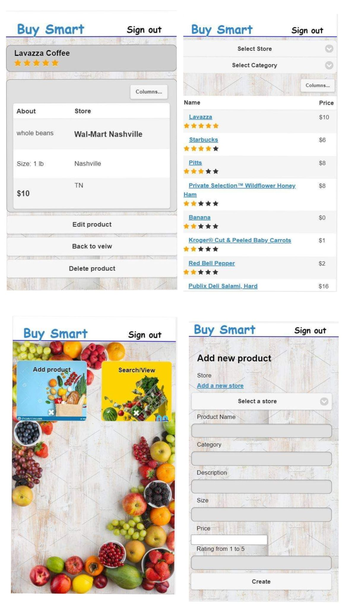

# Buy Smart
<a href=""></a>
<a href=""></a>
<a href=""></a>
## About
BuySmart is an app that helps shoppers keep essential information at their fingertips. Shoppers can add their favorite products, including a category, description, size and price, to the app. They can link the product to the appropriate store, and access this information through a mobile-responive framework on their phone or tablet. 
## Technology
This page was built with the following technologies:
```bash
  Handlebars
  JavaScript 
  CSS
  Jquery Mobile
  Backend: Sequelize
  MySQL2
  Express
 ```
<a href=""></a>
<a href="https://handlebarsjs.com/"></a>
<a href=""></a>
<a href="https://demos.jquerymobile.com/1.4.5/"></a>
<a href=""></a>
<a href=""></a>
<a href=""></a>

## Description
 The User will be able to search for the best price from multiple grocery stores. They will also have the ability to input and rank their favorite items. 
 ## Contributors
 * [Alexander Vasilkov](https://github.com/Alex2055)
 * [Tracey Jackson](https://github.com/cjacktwil)
 * [Jena Holtzclaw](https://github.com/jholtzclaw)

## Website
https://fast-bastion-33726.herokuapp.com/

## Release Notes
* Version 1 is an MVP with basic functionality. 

## Screenshots

